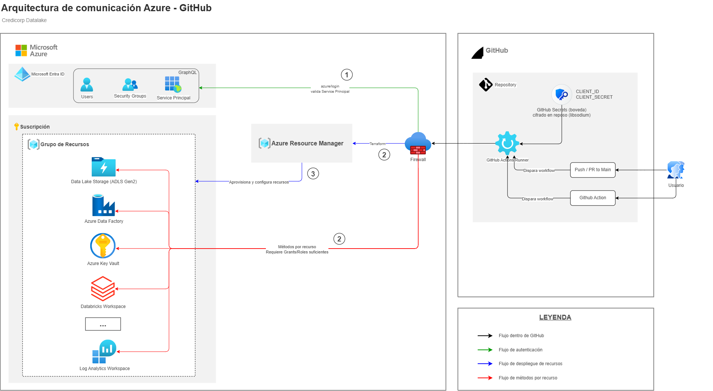
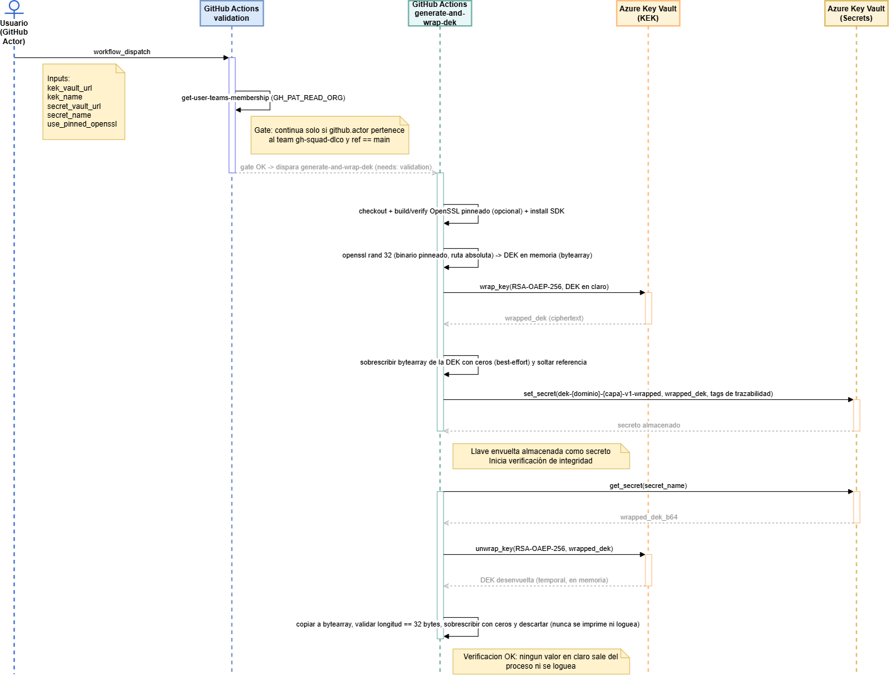

# Aprovisionamiento de Data Encryption Keys (DEK)

Ceremonia de aprovisionamiento inicial de **Data Encryption Keys (DEK)** simétricas para el modelo de envelope encryption de la plataforma de datos, ejecutada vía GitHub Actions con autenticación **Service Principal + client secret** contra Azure Key Vault.

> Evento único de bootstrap por ambiente.

## Alcance

Este repositorio contiene el workflow y los scripts que:

1. Generan una DEK simétrica (AES-256) en memoria del runner.
2. La envuelven (wrap) usando la KEK del segmento correspondiente, vía Azure Key Vault.
3. Persisten únicamente el valor envuelto (ciphertext) como secreto en Key Vault, con metadata de trazabilidad.
4. Verifican la integridad del wrap desenvolviendo el secreto y validando su longitud, sin exponer el valor en claro.
5. Permiten validar credenciales y permisos de forma segura (`plan_only: true`) antes de ejecutar la ceremonia real.

La DEK en texto plano **nunca** persiste fuera de la memoria del runner, nunca se escribe a disco, nunca se pasa por `GITHUB_OUTPUT`, y nunca se imprime en logs.

Además del bootstrap inicial, el repositorio incluye una segunda ceremonia independiente para la **rotación de la KEK** una vez que esta cambia de versión en Key Vault — ver [Bootstrap de DEK](#bootstrap-de-dek) y [Rotación de KEK](#rotación-de-kek) más abajo.

## Diagramas

### Arquitectura de comunicación GitHub ↔ Azure

Autenticación del Service Principal (`CLIENT_ID`/`CLIENT_SECRET` como GitHub Secrets), el rol de Azure Resource Manager y el firewall, y los métodos por recurso (Key Vault, Data Lake, Databricks, etc.) que requieren grants/roles propios.



### Secuencia de la ceremonia DEK Bootstrap

Flujo completo del workflow `dek-bootstrap.yml`: gate de autorización por membresía de team, y la ceremonia real de generación, wrap y verificación de la DEK contra Azure Key Vault.



Fuentes editables en [docs/](docs/) (`.drawio`, abrir con draw.io desktop o app.diagrams.net).

## Estructura del repositorio

```
.
├── .github/
│   └── workflows/
│       ├── dek-bootstrap.yml      # Workflow de la ceremonia de bootstrap
│       └── kek-rotation.yml       # Workflow de la ceremonia de rotación de KEK
├── scripts/
│   ├── check_auth.py              # Validación de credenciales (modo plan_only, solo lectura)
│   ├── dek_bootstrap.py           # Generación + wrap + almacenamiento
│   ├── rotate_kek.py              # Unwrap con versión vieja + rewrap con versión vigente de la KEK
│   └── verify_dek.py              # Verificación post-wrap (unwrap + validación de longitud)
└── README.md
```

## Modelo de autenticación

**Service Principal + client secret**, alineado al estándar organizacional vigente (`credicorp-internal`). Esto es una desviación intencional del principio "sin credenciales estáticas" evaluado originalmente con OIDC federation — ver la nota en el ADR de arquitectura sobre este trade-off.

Los scripts de Python construyen la credencial explícitamente con `ClientSecretCredential`, a partir de variables de entorno pasadas en cada step. Esto evita depender de una sesión de Azure CLI o de `DefaultAzureCredential()`, cuya cadena de fallback puede resolver una identidad distinta a la esperada si el runner tiene otros contextos disponibles.

```python
credential = ClientSecretCredential(
    tenant_id=os.environ["AZURE_TENANT_ID"],
    client_id=os.environ["AZURE_CLIENT_ID"],
    client_secret=os.environ["AZURE_CLIENT_SECRET"],
)
```

## Prerrequisitos

- KEK del ambiente ya provisionada en Key Vault.
- App Registration en Entra ID con **client secret** generado (Certificates & secrets → New client secret).
- Rol `Key Vault Crypto User` asignado al Service Principal sobre la KEK (permite `wrapKey`/`unwrapKey`). El rol se otorga sobre la key completa, no por versión — cubre automáticamente cualquier versión futura tras una rotación, sin necesidad de reautorizar nada.
- Rol `Key Vault Secrets Officer` asignado al Service Principal sobre el vault de almacenamiento de secretos (permite `setSecret`/`getSecret`). Namespace de permisos distinto al anterior — ambos roles son requeridos.
- Un GitHub team (ej. `gh-data-security`) cuyos miembros estén autorizados a disparar la ceremonia.
- Secrets y variables configurados (ver siguiente sección).

## Configuración de identidad

### Opción CLI

```bash
# 1. Crear App Registration
az ad app create --display-name "github-actions-dek-bootstrap"

# 2. Crear Service Principal asociado
az ad sp create --id <APP_ID>

# 3. Generar client secret
az ad app credential reset --id <APP_ID> --display-name "github-actions-dek-bootstrap-secret"
#    Copiar el valor del secret inmediatamente — no se puede recuperar después.

# 4. Asignar permisos de wrap/unwrap sobre la KEK
az role assignment create \
  --assignee <SP_OBJECT_ID> \
  --role "Key Vault Crypto User" \
  --scope <KEK_RESOURCE_ID>

# 5. Asignar permisos de gestión de secretos sobre el vault de almacenamiento
az role assignment create \
  --assignee <SP_OBJECT_ID> \
  --role "Key Vault Secrets Officer" \
  --scope <SECRET_VAULT_RESOURCE_ID>
```
> "github-actions-dek-bootstrap" y "github-actions-dek-bootstrap-secret" son nombres referenciales.

### Opción manual — Azure Portal

Alternativa a los comandos CLI, útil si no tienes acceso a Azure CLI o si otro equipo (ej. Seguridad/IAM) debe ejecutar estos pasos por segregación de funciones.

**1. Crear el App Registration**

- Entra ID → **App registrations** → **New registration**.
- Nombre: `github-actions-dek-bootstrap`.
- Supported account types: *Accounts in this organizational directory only* (single tenant).
- **Register**.
- En **Overview**, copiar el **Application (client) ID** → `AZURE_CLIENT_ID_SP`.

**2. Generar el client secret**

- En la misma app → **Certificates & secrets** → pestaña **Client secrets** → **New client secret**.
- Descripción y expiración (definir según política de rotación de la organización).
- **Add** → copiar el **Value** inmediatamente (no se vuelve a mostrar) → `AZURE_CLIENT_SECRET_SP`.

**3. Asignar el rol sobre la KEK**

- Ir al Key Vault que contiene la KEK → **Access control (IAM)** → **Add** → **Add role assignment**.
- Role: `Key Vault Crypto User`.
- Members: buscar y seleccionar `github-actions-dek-bootstrap`.
- **Review + assign**.
- Nota: el Portal generalmente asigna el rol a nivel de vault completo. Para scope granular sobre una key específica, usar el blade de la key individual (**Keys** → seleccionar la KEK → **Access control (IAM)**) si el SKU lo permite, o usar CLI.

**4. Asignar el rol sobre el vault de secretos**

- Repetir el paso anterior sobre el Key Vault donde se almacenará la DEK envuelta.
- Role: `Key Vault Secrets Officer`.

**5. Obtener Tenant ID y Subscription ID**

- **Tenant ID**: Entra ID → **Overview** → campo *Tenant ID*.
- **Subscription ID**: **Subscriptions** → seleccionar la suscripción correspondiente → campo *Subscription ID*.

> "github-actions-dek-bootstrap" es un nombre referencial.

## Configuración de secrets y variables en GitHub

**Settings → Secrets and variables → Actions**

| Nombre | Tipo | Valor |
|---|---|---|
| `AZURE_CLIENT_ID_SP` | Secret | Application (client) ID del App Registration |
| `AZURE_CLIENT_SECRET_SP` | Secret | Client secret generado en el paso anterior |
| `GH_PAT_READ_ORG` | Secret | Personal Access Token con permiso de lectura sobre membresía de teams de la organización |
| `AZURE_TENANT_ID` | Variable | Tenant ID de Entra ID |

### Control gate por membresía de equipo

Ambos workflows (`dek-bootstrap.yml` y `kek-rotation.yml`) implementan su propio gate de autorización mediante un job `validation` que verifica si `github.actor` pertenece a un GitHub team autorizado (ej. `gh-data-security`), usando la action `tspascoal/get-user-teams-membership@v2`. El job de la ceremonia solo se ejecuta si esa condición se cumple:

```yaml
if: github.ref == 'refs/heads/main' && contains(needs.validation.outputs.teams, 'gh-data-security')
```

Ajustar `gh-data-security` al nombre real del team autorizado en la organización.

## Bootstrap de DEK

Ceremonia de aprovisionamiento inicial (`.github/workflows/dek-bootstrap.yml`): genera la DEK, la envuelve con la KEK vigente y almacena únicamente el valor envuelto en Key Vault. Es un evento único por ambiente — ver [Notas operativas](#notas-operativas).

### Ejecución

1. Ve a la pestaña **Actions** → `DEK Bootstrap Ceremony - Production` → **Run workflow**.
2. Ingresa `kek_vault_url‎`, `kek_name‎`, `secret_vault_url‎` y 'secret_name'.‎
3. Opcional: marca `plan_only: true` para solo validar credenciales y permisos, sin generar ni almacenar ninguna DEK (ver siguiente sección).
4. El job `validation` verifica la membresía de equipo del actor.
5. Si el gate pasa, el job `generate-and-wrap-dek` ejecuta:
   - Instalación del SDK.
   - (Si `plan_only: true`) Validación de credenciales — ver abajo — y el job termina ahí.
   - (Si `plan_only: false`) Generación y wrap de la DEK, almacenamiento del secreto `dek-<domain>-<layer>-v1-wrapped` con tags de trazabilidad, y verificación de integridad automática.

### Modo `plan_only` — validación de credenciales

Ejecuta `scripts/check_auth.py`, que confirma sin efectos secundarios:

- Que las credenciales (`AZURE_CLIENT_ID`, `AZURE_CLIENT_SECRET`, `AZURE_TENANT_ID`) autentican correctamente.
- Que el Service Principal puede leer metadata de la KEK (`get_key`).
- Que el Service Principal puede listar (no leer valores) el vault de secretos.

**Limitación conocida**: esto valida permisos de *lectura*, no los de *escritura* (`wrapKey`, `setSecret`) que la ceremonia real requiere. Un `plan_only` exitoso no garantiza que el `bootstrap` real vaya a pasar el chequeo de RBAC — solo descarta errores de credenciales mal configuradas o roles completamente ausentes.

### Verificar el resultado

**Tags de trazabilidad del secreto:**

```bash
az keyvault secret show \
  --vault-name <secret-vault-name> \
  --name <secret-name> \
  --query "tags"
```

Tags esperadas tras el bootstrap: `kek_vault`, `wrapped_with_kek`, `wrapped_with_kek_version`, `algorithm`, `provisioned_by`, `provisioned_at`, `ceremony_run_id`.

**Integridad del wrap**: se ejecuta automáticamente como parte del job (`Verify wrapped DEK integrity`), vía `scripts/verify_dek.py`. El log del step confirma longitud de 32 bytes sin exponer el valor.

### Generación de la DEK: mecanismo basado en OpenSSL

A pedido del equipo de seguridad, la generación de la DEK no usa `os.urandom()` de Python sino el comando `openssl rand 32`, invocado como subproceso desde [dek_bootstrap.py](scripts/dek_bootstrap.py). Esto se sostiene en dos piezas del workflow:

1. El step `Build and install pinned OpenSSL` compila OpenSSL desde el tarball oficial, verifica su SHA256 contra el valor fijado en `OPENSSL_VERSION`/`OPENSSL_SHA256` (env del job), e instala el binario en `OPENSSL_INSTALL_DIR`.
2. `dek_bootstrap.py` resuelve el binario por **ruta absoluta** a ese build pinneado (`OPENSSL_INSTALL_DIR/bin/openssl`) en vez de confiar en el `PATH` — así se evita que otro `openssl` presente en el runner reemplace silenciosamente al binario auditado. Si `use_pinned_openssl: false`, cae de vuelta al `openssl` del sistema.

**Versión pinneada — mantenimiento requerido**: se usa la rama LTS de OpenSSL (`3.5.x`, actualmente `3.5.7`, soporte hasta abril de 2030), en vez de una rama no-LTS de soporte corto (~13 meses). Antes de esa fecha, actualizar `OPENSSL_VERSION`/`OPENSSL_SHA256` en el YAML a la siguiente rama LTS — verificar el hash oficial directamente contra `https://www.openssl.org/source/openssl-<version>.tar.gz.sha256` antes de aplicarlo, nunca copiarlo de una fuente intermedia sin confirmar.

**Nota de alcance — no confundir con FIPS**: este mecanismo satisface el requisito de "generación basada en OpenSSL", pero el build no está compilado con el proveedor FIPS 140 (`enable-fips`). La activación de modo FIPS fue evaluada y descartada por la plataforma de GitHub Actions al no admitirse runners self-hosted — es una brecha aceptada explícitamente, no cubierta por este control.

**Enmascarado de logs — limitación conocida**: GitHub Actions enmascara automáticamente en los logs los valores provenientes del contexto `secrets.*` (ej. `AZURE_CLIENT_SECRET_SP`), pero **no** los valores generados en tiempo de ejecución como la DEK — esta no tiene ese enmascarado automático porque no está registrada como secret. La protección real depende exclusivamente de que el código nunca imprima `dek_bytes` ni el valor envuelto (ver comentarios explícitos en cada script), no de una red de seguridad del runner.

**Limitación de la sobrescritura en memoria**: `bytes` en Python es inmutable — `dek_bytes = None` por sí solo suelta la referencia pero no borra el contenido. `dek_bootstrap.py` (para la DEK recién generada) y `verify_dek.py` (para la DEK desenvuelta desde `unwrap_key()`) copian el valor a un `bytearray` y lo sobrescriben con ceros explícitamente antes de descartarlo, pero esto es *best-effort*: no hay `mlock`/`memset` a nivel de página en Python puro, y no cubre copias internas que el SDK de Azure o el runtime de Python puedan haber hecho durante la llamada de red a Key Vault — en `verify_dek.py` en particular, la copia que zeramos es la nuestra, no la que `result.key` (bytes inmutable devuelto por el SDK) ya trae internamente. El riesgo residual se acota por la naturaleza efímera del runner (la VM se destruye al terminar el job).

## Rotación de KEK

Ceremonia separada (`.github/workflows/kek-rotation.yml`), para cuando la KEK debe reemplazarse (expiración, compromiso, política de rotación). **Importante**: este workflow **no** rota la key en Key Vault — Key Vault versiona las keys nativamente, y la rotación en sí (creación de una nueva versión) ocurre del lado de Azure, vía política de rotación automática o `az keyvault key rotate` manual, **antes** de correr esta ceremonia. El trabajo de este workflow es exclusivamente re-proteger la DEK ya almacenada: desenvolverla con la versión vieja de la KEK y volver a envolverla con la versión vigente, sin exponer el valor en claro en ningún momento.

El secreto se sobrescribe con el mismo nombre (`secret_name`) — Key Vault crea automáticamente una nueva versión del secreto y conserva las anteriores para rollback/auditoría. Cualquier consumidor que pida la versión "latest" recibe el valor rotado sin ningún cambio de configuración de su parte.

### Cómo se ubica la versión vieja de la KEK

Para desenvolver correctamente el secreto actual, el script necesita saber con qué versión específica de la KEK fue envuelto. Desde este cambio, `dek_bootstrap.py` guarda esa versión en la tag `wrapped_with_kek_version` de cada secreto que crea, y `rotate_kek.py` la lee de ahí automáticamente. Si el secreto no tiene esa tag (por ejemplo, si fue creado manualmente o antes de este cambio), se puede indicar explícitamente vía el input `old_kek_version`, que tiene prioridad sobre la tag. Si no hay tag ni override, el script falla con un mensaje claro en vez de adivinar.

### Ejecución

1. Ve a la pestaña **Actions** → `KEK Rotation Ceremony` → **Run workflow**.
2. Ingresa `kek_vault_url`, `kek_name`, `secret_vault_url` y `secret_name` (la misma KEK y el mismo secreto del bootstrap original).
3. Deja `old_kek_version` vacío salvo que necesites forzar una versión distinta a la de la tag del secreto.
4. Opcional: marca `plan_only: true` para solo validar credenciales y permisos (reutiliza `check_auth.py`, igual que en el bootstrap) sin re-envolver nada.
5. El job `validation` verifica la membresía de equipo del actor (mismo gate `gh-squad-dlco` que el bootstrap).
6. Si el gate pasa, el job `rotate-kek` ejecuta `rotate_kek.py` (unwrap con la versión vieja → validación de longitud → rewrap con la versión vigente → almacenamiento) y luego `verify_dek.py` sin modificaciones, para confirmar que el secreto resultante desenvuelve correctamente bajo la nueva versión.

### Guard de no-op

Si al momento de re-envolver la versión vigente de la KEK resulta ser la misma que la versión vieja, el script aborta con error: significa que la key todavía no fue rotada en Key Vault y no hay nada que re-proteger. Rotar la key en Azure es un prerrequisito de esta ceremonia, no algo que ella misma haga.

### Verificar el resultado

**Tags de trazabilidad del secreto:**

```bash
az keyvault secret show \
  --vault-name <secret-vault-name> \
  --name <secret-name> \
  --query "tags"
```

Tags esperadas tras una rotación (se suman/sobrescriben sobre las anteriores): `wrapped_with_kek_version` (actualizada a la versión nueva), `rotated_from_kek_version`, `rotated_at`, `rotation_run_id`. `provisioned_by`/`provisioned_at` se conservan sin cambios — la DEK subyacente no se regenera, solo se re-protege.

**Integridad del rewrap**: se ejecuta automáticamente como parte del job (`Verify rotated DEK integrity`), reutilizando `scripts/verify_dek.py` sin modificaciones y apuntado a la versión vigente de la KEK. El log del step confirma longitud de 32 bytes sin exponer el valor.

## Controles de seguridad

| Control | Ceremonia | Implementación |
|---|---|---|
| Generación y wrap atómico | Bootstrap | Mismo step, mismo job — la DEK en claro nunca se serializa entre steps |
| Prohibición de persistencia en claro | Ambas | Nunca se escribe a disco, `GITHUB_OUTPUT`, ni logs |
| Credencial explícita | Ambas | `ClientSecretCredential` construida directamente en cada script, sin depender de `DefaultAzureCredential()` ni de sesiones de CLI |
| Scope de permisos mínimo | Ambas | SP con permisos acotados a la KEK y al vault de secretos específicos, no acceso amplio |
| Aprobación de ejecución | Ambas | Gate por membresía de GitHub team |
| Runner efímero | Ambas | GitHub-hosted, destruido al finalizar el job |
| Trazabilidad | Ambas | Tags del secreto + run ID de GitHub Actions correlacionable con logs de Key Vault |
| Verificación de integridad | Ambas | Unwrap post-almacenamiento con validación de longitud, sin exponer el valor |
| Validación previa sin efectos secundarios | Ambas | Modo `plan_only` para probar credenciales antes de una ejecución real |
| Generación basada en OpenSSL | Bootstrap | La DEK se genera con `openssl rand 32`, resuelto por ruta absoluta al binario pinneado (no por `PATH`) — ver [Generación de la DEK: mecanismo basado en OpenSSL](#generación-de-la-dek-mecanismo-basado-en-openssl) |
| Build de OpenSSL pinneado y verificado | Bootstrap | Versión y SHA256 fijados en el workflow, verificados con `sha256sum --check --strict` antes de compilar |
| Prohibición de logging HTTP verbose del SDK de Azure | Ambas | `wrap_key()` y `unwrap_key()` transmiten la DEK en claro en el body de la llamada a Key Vault — nunca habilitar `logging_enable=True` / `AZURE_LOG_LEVEL=debug` en estos scripts (ver nota en cada archivo) |
| Sobrescritura best-effort de la DEK en memoria | Ambas | `dek_bootstrap.py` (DEK generada), `verify_dek.py` (DEK desenvuelta) y `rotate_kek.py` (DEK desenvuelta y re-envuelta) usan `bytearray` y sobrescriben el buffer con ceros antes de soltar la referencia — mitigación parcial, ver limitaciones en [Generación de la DEK](#generación-de-la-dek-mecanismo-basado-en-openssl) |
| Rotación de KEK sin exposición de la DEK | Rotación | `rotate_kek.py` desenvuelve con la versión vieja de la KEK y re-envuelve con la versión vigente en un único proceso en memoria; `set_secret()` es la única llamada mutadora y va al final — si el unwrap o la validación de longitud fallan, no se escribe nada |
| Versionado nativo de Key Vault en vez de naming propio | Rotación | El secreto rotado sobrescribe el mismo `secret_name` (Key Vault crea una versión nueva automáticamente y conserva las anteriores) — evita coordinar cambios de configuración en los consumidores al rotar |

## Notas operativas

- Trade-off de seguridad aceptado: autenticación con client secret (credencial estática) en lugar de OIDC federation, para alinear con el estándar organizacional.
- El workflow depende de `actions/checkout@v5`. GitHub está migrando el runtime de Actions de Node 20 a Node 24; si aparecen warnings de deprecación, confirmar que el job ya corre en Node 24 (mensaje "This workflow is running with Node 24 by default" en el log) — es informativo, no bloquea la ejecución.
- En el step "Generate, wrap, and store DEK" (bootstrap) puede aparecer en el log "Local wrap operation failed: 'bytearray' object is not an instance of 'bytes'". Es inofensivo: el SDK de Azure intenta primero envolver la DEK localmente (requiere `bytes` estricto) y, al fallar por el tipo `bytearray` (usado a propósito para poder zerar la DEK en memoria — ver más arriba), reintenta automáticamente contra el servicio de Key Vault, que sí completa el wrap correctamente. Confirmar que el step igual termina con "DEK wrapped and stored successfully." y que la verificación de integridad posterior pasa. El mismo comportamiento aplica al step "Unwrap and rewrap DEK" de la rotación.
- Ambas ceremonias son procedimientos de **ceremonia**, no un pipeline operativo recurrente. Se sugiere que cada ejecución quede documentada.
- Tras el aprovisionamiento inicial de todos los ambientes requeridos, evaluar deshabilitar (no eliminar) el Service Principal asociado, dado que la rotación de DEKs está proyectada a varios años.
- **Exposición esperada de la DEK ante Key Vault**: como la KEK vive en HSM y su clave privada no es exportable, la operación `wrapKey`/`unwrapKey` la ejecuta el servicio de Key Vault del lado servidor — la DEK en claro viaja dentro del body de esa llamada HTTPS hacia Key Vault. Es exposición esperada y necesaria para este modelo de envelope encryption (va cifrada en tránsito por TLS); Azure documenta que los logs de diagnóstico de Key Vault registran metadata de la operación, nunca el material de la clave. Esto aplica tanto al bootstrap como a la rotación.
- **Pendiente conocido**: el nombre del GitHub team autorizado difiere entre el YAML (`gh-squad-dlco`, gate real en ambos workflows) y este README (documentado antes como `gh-data-security`) — confirmar el nombre vigente y unificarlo antes de depender de este control en producción.
- **Pendiente conocido**: `dek_bootstrap.py` y `verify_dek.py` instancian `DefaultAzureCredential()`, mientras que `check_auth.py` y `rotate_kek.py` usan `ClientSecretCredential` explícito como describe la sección [Modelo de autenticación](#modelo-de-autenticación). Funciona igual en la práctica (`DefaultAzureCredential` resuelve `AZURE_CLIENT_ID`/`AZURE_CLIENT_SECRET`/`AZURE_TENANT_ID` vía su `EnvironmentCredential`), pero es inconsistente con el razonamiento de evitar cadenas de fallback impredecibles — alinear los dos scripts restantes a `ClientSecretCredential` explícito.
